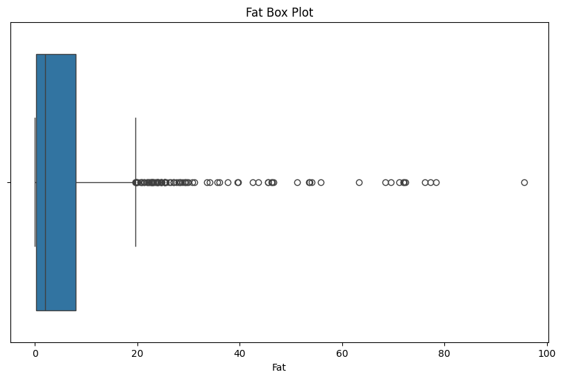

# Nutrition Density Modeling & Clustering

This project explores the nutritional quality of over 1,400 food items. Using a combination of regression and clustering techniques, we try to both **predict** nutrition density and **group similar foods** based on their macro and micronutrient profiles.

---

## Section 1: Exploratory Data Analysis

We start by formatting the data and removing illogical or extreme entries. This includes:
- Standardizing all micronutrient features to grams
- Dropping any food with >100g of any nutrient or >900 calories per 100g
- Removing extreme outliers like protein shakes or extremely dense cheeses

There were no missing values, and all datatypes were correct from the start.

---

### Nutrition Density Distribution

The target variable is **right-skewed** with outliers — as expected with food data. Most foods are low in nutritional density, but a few are very high.

---

### Correlation Heatmap

Several nutrients correlate well with Nutrition Density:
- Calcium, Phosphorus, Potassium (micronutrients)
- Fat and Carbohydrates (macronutrients)

---

### Top Correlated Features (Regression Lines)

Scatterplots confirm that **Calcium** shows the strongest linear relationship with Nutrition Density. Other nutrients like Phosphorus and Fat also show clear trends.

---

### Macronutrient Distributions

Macronutrients like Fat, Protein, Carbs, and Calories all show **right-skewed** distributions — especially Fat.

#### Caloric Value

#### Fat

#### Protein

#### Carbohydrates

---

## Section 2: Supervised Learning – Regression

We tested a range of regression models to predict Nutrition Density using scaled features and cross-validation for hyperparameter tuning.

---

### Model Comparison – Mean Squared Error (MSE)

| Model                   | MSE       |
|------------------------|-----------|
| Linear Regression       | **0.0023** |
| Ridge Regression        | **0.0022** |
| Lasso Regression        | 0.0041    |
| Decision Tree           | 162.38    |
| Random Forest           | 198.56    |
| AdaBoost                | 463.07    |
| XGBoost                 | 35.09     |
| Support Vector Regressor| **0.0024** |
| Neural Network (final)  | ~26.64    |

**Takeaway**: Models with linear assumptions consistently performed best. Ridge and SVR had the lowest errors.

---

### Neural Network Summary

We trained a fully connected neural net using PyTorch on GPU. While test loss improved across epochs (dropping from ~4900 to ~27), the final performance was still weaker than our best linear models.

> No loss curve included, but model learned the pattern decently.

---

## Section 3: Unsupervised Learning – Clustering & PCA

We used clustering to group similar foods, using log-transformed and standardized nutrient data projected with PCA.

---

### K-Means Clustering (k=5)

Clusters weren’t super distinct. There was a lot of overlap, and K-Means didn’t split the foods in a very interpretable way.

---

### Agglomerative (Hierarchical) Clustering

Agglomerative clustering performed better, showing clearer boundaries between food groups. From manual inspection, the clusters roughly mapped to:
- Wheat-based foods
- Seeds/nuts
- Meat-based items
- Fast food
- Spices and small ingredients

> We skipped generating word clouds, but clusters still showed decent semantic meaning when reviewed.

---

## Key Takeaways

- **Right-skewed data** is everywhere — most nutrients and the target itself
- **Linear relationships dominate** — simple regression wins over complex methods
- **Ridge Regression and SVR** had the best prediction performance
- **Neural networks worked** but weren’t worth the extra effort here
- **Hierarchical clustering** outperformed KMeans for meaningful groupings

